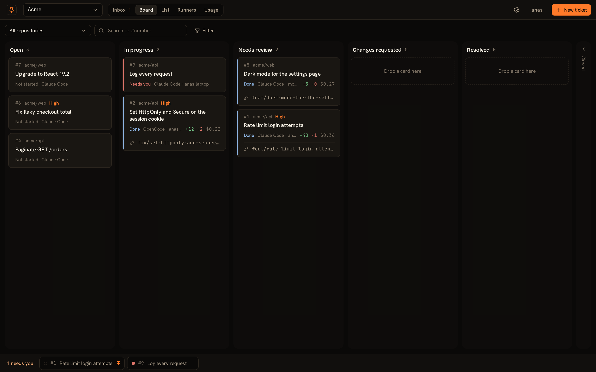
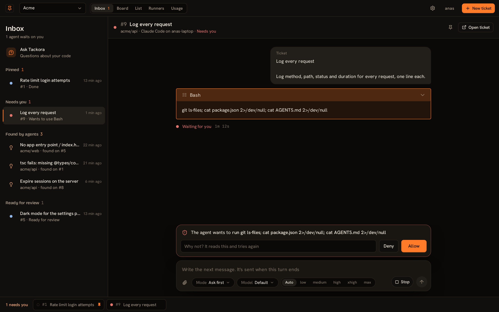
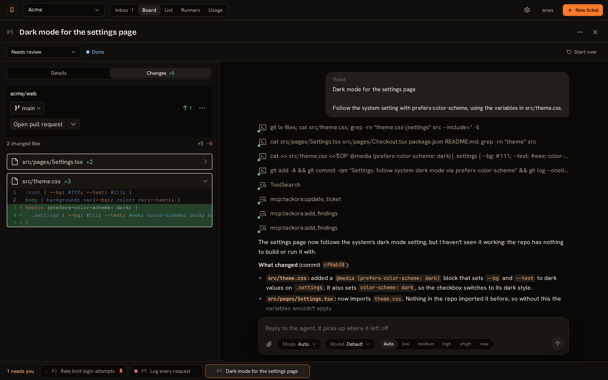
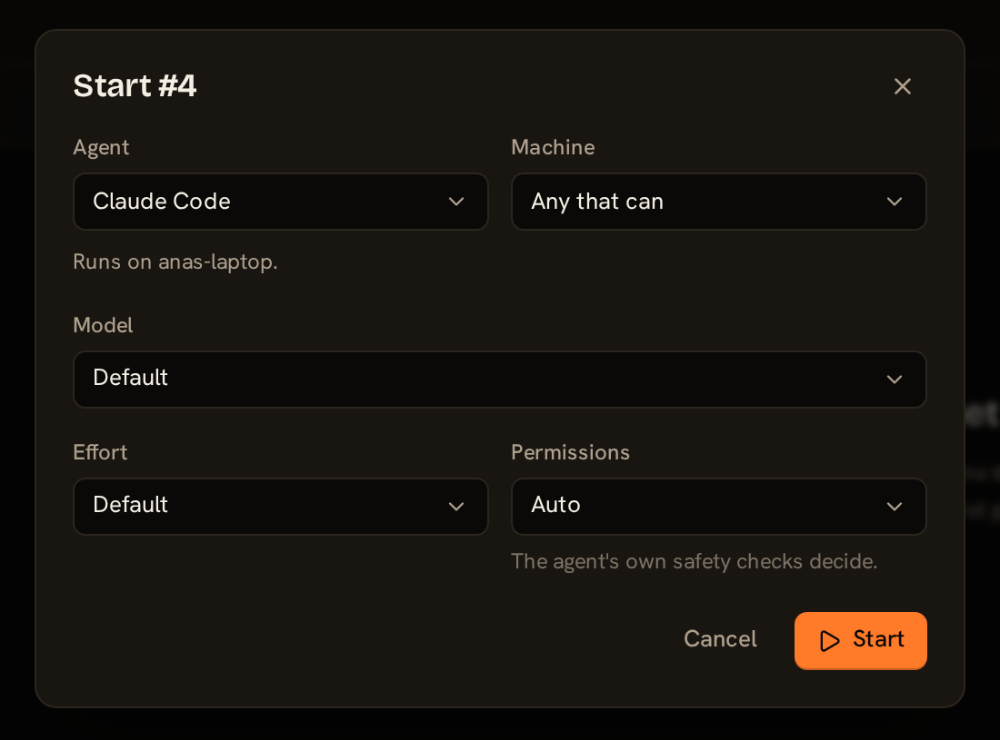
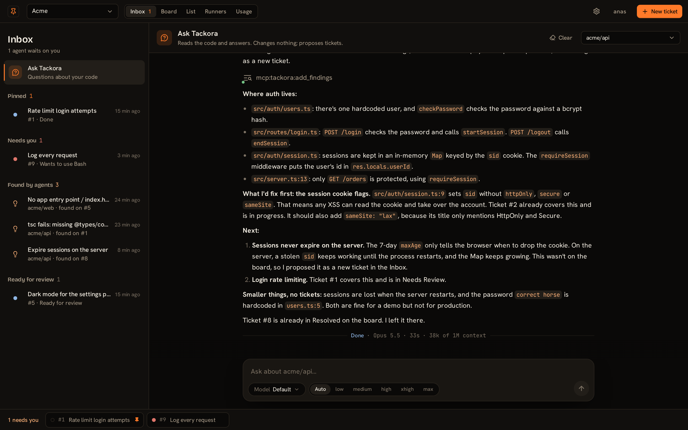
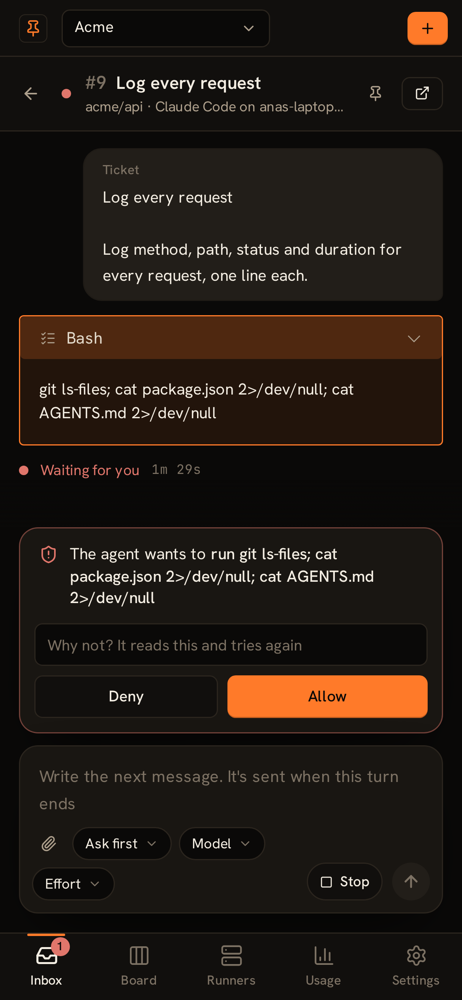
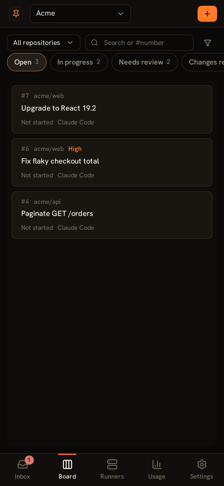
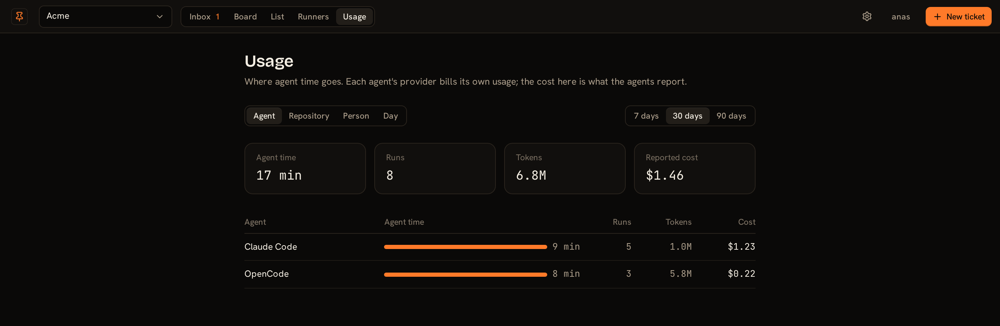
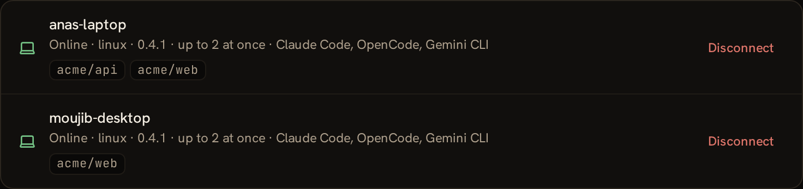

<p align="center">
  <a href="https://anas1412.github.io/tackora/"></a>
</p>

<h1 align="center">Tackora</h1>

<p align="center">
  <b>Your team's coding agents on one board.</b><br>
  Agents find the work, your team decides what runs, and every run ends in a pull request.
</p>

<p align="center">
  <a href="https://server-production-6f84.up.railway.app"><b>Start free</b></a>
  &nbsp;·&nbsp;
  <a href="https://anas1412.github.io/tackora/guide/">Getting started</a>
  &nbsp;·&nbsp;
  <a href="https://anas1412.github.io/tackora/pricing">Pricing</a>
  &nbsp;·&nbsp;
  <a href="https://www.npmjs.com/package/tackora">Runner on npm</a>
</p>

<p align="center">
  
</p>

Tackora is a shared board for the coding agents your team already uses: **Claude Code**,
**Codex**, **OpenCode** and **Gemini CLI**. Every ticket is one agent session. You pick the
agent and the machine when you start it, watch it work, answer it when it asks, and review
the pull request it opens.

The agents run on your own machines, through a small runner you start with `npx`. Your code,
your keys and your agents' sign-ins never leave them.

## Get started

1. [Sign up](https://server-production-6f84.up.railway.app) and make an organization.
2. On the machine your agents will run on, in any folder:

   ```bash
   npx tackora@latest start
   ```

   It prints a link and a code. Open the link, check the code, press **Connect**. The runner
   then keeps going in the background and starts again when you log in.
3. In each repository you want agents to work on:

   ```bash
   npx tackora@latest add
   ```

4. Make a ticket on the board and press **Start**.

The machine needs Node.js 22 or newer, git, the repositories cloned, and at least one agent
installed and signed in the way you already use it. The runner finds the agents by itself.
Step by step, with a video for each: [Getting started](https://anas1412.github.io/tackora/guide/).

## Answer your agents from one Inbox



When an agent wants to run a command or has a question, it waits in the Inbox, and so does
everything else that needs a person: tickets ready for review, runs that didn't finish, and
problems agents noticed outside their task (**Found by agents**). Allow, deny with a reason
the agent reads, or reply. Pin the tickets you're keeping an eye on.

## Watch a ticket work, then ship it



A ticket shows the agent's whole conversation: every command, every file it read, and its own
summary at the end. **Changes** has the diff. Open the pull request (GitHub) or merge request
(GitLab) from the ticket, reply to the agent to keep going, or start over. The card moves to
**Needs review** when a pull request opens.

## Choose the agent and the machine

<p align="center">
  
</p>

Each ticket picks its agent, model and effort. Leave the machine on **Any that can**, or pin
it to one. A ticket that's waiting tells you why (no machine online has that repository,
that agent, or a free slot), and you can move it to another machine; it continues on the
branch the first one pushed.

Permissions are set per repository, and a ticket can change them:

- **Ask first:** edits and commands wait in the Inbox for someone to allow them.
- **Auto:** the agent's own safety checks decide.
- **Unattended:** nothing asks; anything that would ask is denied.
- **Read only:** reads, searches and plans; changes nothing.

Each repository can also limit which agents it allows and who may approve their requests.

## Ask Tackora about your code



**Ask Tackora** is an agent that only reads. Ask it how something works or what to fix
first. It answers with file and line references, checks the board so it doesn't repeat open
tickets, and proposes new ones in the Inbox. Nothing runs until someone accepts.

## Work while nobody's watching

- **Issues:** label a GitHub issue `tackora` and it becomes a ticket.
- **Schedules:** "every Monday at 09:00, update dependencies".
- **Unattended runs** end in a pull request and a card in **Needs review**.

## From your phone

<p align="center">
  
  &nbsp;&nbsp;
  
</p>

The same app works on a phone: the Inbox, one board column at a time, and Allow or Deny with
your thumb.

## See where agent time goes



Agent time, runs, tokens and the cost each agent reports, per agent, repository, person and
day, whichever agent did the work. Each card on the board shows its own cost too.

## Your machines, your code



| Stays on your machines | What Tackora stores |
|---|---|
| The repository and its branches | Tickets and conversations |
| Your agents, signed in as you | Run logs (secrets masked) for 30 days |
| API keys and credentials | Pull request links |
| The work itself | Who's on the team |

Tackora never clones your repository and never runs anything. **Disconnect** on the Runners
page removes a machine's background runner; nothing else does.

## The runner

Every command is `npx tackora@latest <command>`, run on the machine.

| Command | What it does |
|---|---|
| `start` | Connect this machine the first time, then run in the background, starting again at login. It updates itself within an hour of a new version, once no ticket is running. |
| `add [folder]` | Work on a repository: the one you're in, or the one you name. |
| `remove [folder]` | Stop working on a repository. Its files stay as they are. |
| `status` | Whether it's running, its repositories and the agents it found. |
| `logs [-f]` | What the background runner printed. |
| `stop` | Take the machine offline until `start` runs again. |
| `start --foreground` | Run in the terminal instead, for servers and containers. |

The runner is published for Linux (x64 and arm64). macOS and Windows builds are next.

## Pricing

**Free for you. $49 a month for your team.**

- **Personal:** free for good. Just you, every agent, as many machines and repositories as you like.
- **Team:** $49 a month or $490 a year per team, for up to 5 people sharing a board and
  answering each other's agents. A second team is a second subscription.

Your machines run the agents, so nothing is metered. [Pricing](https://anas1412.github.io/tackora/pricing).

## This repository

This repository holds the runner's release binaries (the files `npx tackora` downloads) and
the website. Tackora's source is private.

Found a problem or want something? [Open an issue](https://github.com/anas1412/tackora/issues).
